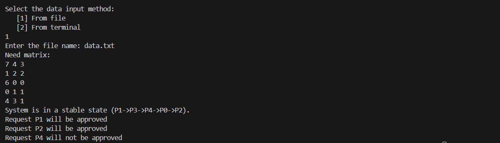
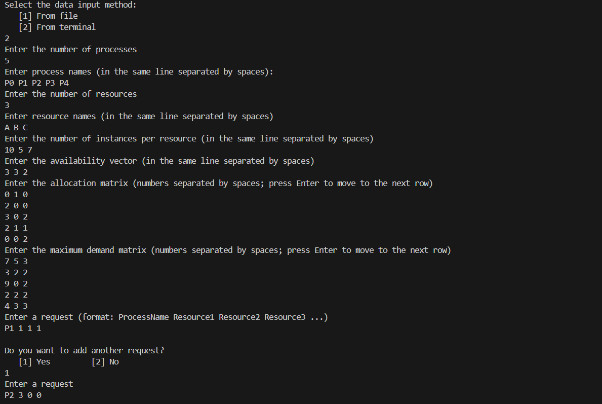
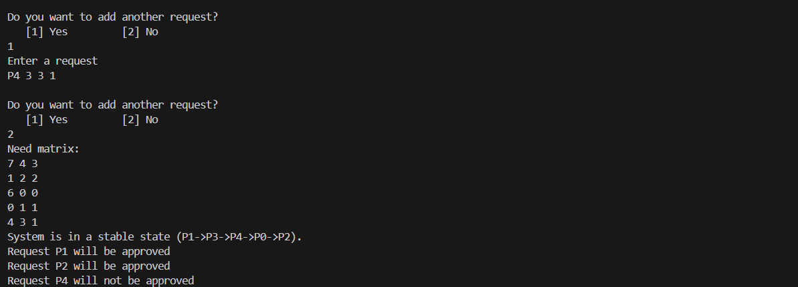

# Banker's Algorithm

## Project Overview

This project is an implementation of the **Banker’s Algorithm** in **C++**, which is a resource allocation and deadlock avoidance algorithm used in operating systems. The program allows the user to input process and resource information either **from a file** or **through the terminal**. It then checks if the system is in a safe state, determines a possible safe sequence and evaluates whether new resource requests can be granted without leading to deadlock (a state where processes are stuck, each waiting for resources held by others).

## Key Features

- **Safe State Detection:**  
  Determines if the system is currently in a safe state using Banker’s Algorithm.

- **Safe Sequence Calculation:**  
  If the system is safe, the program outputs a valid sequence of process execution.

- **Request Handling:**  
  The program evaluates additional resource requests from processes and determines if they can be safely granted.

- **Matrices Management:**  
  Works with the core matrices of the Banker’s Algorithm:
  - **Allocation Matrix** – resources currently allocated  
  - **Max (Demand) Matrix** – maximum resource needs of processes  
  - **Need Matrix** – remaining resources required for completion  

- **Flexible Input Options:**  
  Users can choose to load input data:
  - From a **text file** (custom format)
  - Through **manual entry** in the terminal

## Input Files

- **Text File (.txt):**  
  Must follow the format:
  - number of processes, process names (separated by commas)
  - number of resources, resource names (separated by commas)
  - number of instances per resource (separated by commas)
  - allocation matrix (rows separated by newline, values by space)
  - availability vector (numbers separated by commas)
  - maximum demand matrix (rows separated by newline, values by space)
  - requests (process name, resources; one request per line) 

*The file `data.txt` in this repository provides an example of this format and can be used to test and run the program.*

## Program Demonstration

Below are screenshots showcasing the program in action:

**Input via File:**
- Screenshot showing the program running with process and resource information provided through a text file (data.txt).

**Input via Terminal:**
- Screenshots showing the program running with process and resource information entered manually by the user through the terminal.

*The same data is used in both input methods to ensure consistent results.*

### How to Use the Program

1. Compile the program using a C++ compiler
2. Run the executable file.  
3. Choose the input method 
4. The program will:  
   - Print the **Need Matrix**  
   - Check if the system is in a **safe state**  
   - Display the **safe sequence** (if it exists)  
   - Evaluate whether new **requests** can be safely granted  

## Acknowledgements / Inspired by

This project was implemented for educational purposes as part of a Fundamentals of Operating Systems course.